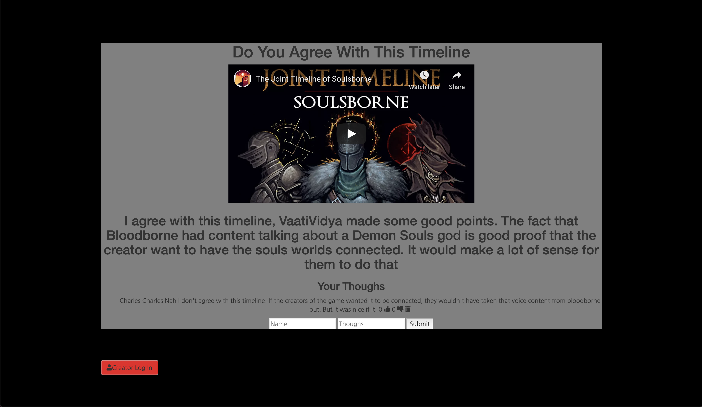

# SoulBorne
 A blog where people can comment about the Dark Souls time line

## How It's Made:

**Tech used:** EJS, CSS, JavaScript, Node js, Express, MongoDB
  I made this project with ejs and place the content where I wanted it to go. After that I created my data base to have it ready. Then I created my routes and server and linked it all together

## Lessons Learned:
I learned how to be better at connecting my data base to my project.
